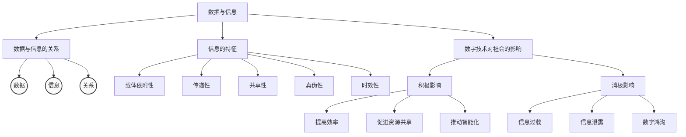

# 课堂电子笔记流程
#### 1. 初步梳理
根据学案内容，初步梳理知识框架
#### 2. AI生成笔记
   - 登陆AI（比如[百度R1满血版](http://www.baidu.com)）
   - 根据学习任务和学习目标，选择不同AI指令模板，补充必要信息。
   - 指定输出格式为Markdown格式，便于后续整理输出。
   - 通过追问AI完善知识框架。
     > AI指令模板参考[《AI辅助学习指令模板参考手册（中学版）》](#ai辅助学习指令模板参考手册中学版)

#### 3. 整理输出
   - 整理输出为Markdown格式，方便后续学习。
     - 复制AI输出内容，粘贴到Markdown编辑器中，进一步完善笔记内容与格式。
     - [Markdown在线编辑器1](https://www.jyshare.com/front-end/712/)
     - [Markdown在线编辑器2](https://tool.lu/markdown/)
   - 整理输出为脑图格式，方便后续学习。
     - [Mermaid在线脑图](https://mermaid.live/edit#示例代码)
     - [JYSHARE在线脑图](https://www.jyshare.com/front-end/9692/)
   - 整理输出为PDF格式，方便后续学习。
  
#### 4. 保存笔记
   - 将整理好的笔记、脑图导出、下载
   - 上传至自己的云空间或云笔记软件中

--- 


# AI辅助学习指令模板参考手册（中学版）

[TOC]

---

## 1. 知识框架梳理
### 指令模板
```prompt
请根据以下关键词/概念：{{核心概念1}}, {{核心概念2}}  
1.输出层级化知识框架（分章节、核心公式/定理）
2.根据{{教材版本}}，符合 {{教学大纲}}，{{考试大纲}} 要求
3. 标注可能的知识盲点 
   - 通俗易懂的解释（避免专业术语堆砌）  
   - 至少2个现实案例或图表说明  
   - 3道难度递增的练习题（附答案关键步骤）   
4. 提供解释+案例+练习题
注：若框架不完整，我将通过追问补充细节。
```
### 使用示例
```Markdown
请根据以下关键词/概念：三角函数，正弦定理，余弦定理  
1. 输出层级化知识框架（分一级标题、二级标题、核心公式）
2. 根据高中数学教材，符合高中数学教学大纲，高中数学考试大纲要求
3. 标注我可能存在的知识盲点（如角度换算）  
4. 对标注的盲点提供：通俗解释 + 现实案例 + 练习题
```
### 示例输出
``````Markdown
# 三角函数知识框架
## 基本概念
### 角度制与弧度制
- 转换公式：  
  ```math
  1° = $\frac{\pi}{180} \text{rad}
  ``` 
### 正弦定理
- 公式：
  ```math
  a^2 = b^2 + c^2 - 2bc\cos A
  ```
- 应用：
  用于求解三角形的边长。

### 余弦定理
- 公式：
  ```math
  b^2 = a^2 + c^2 - 2ac\cos B

  ```   
- 应用：
  用于求解三角形的边长。

## 应用场景
### 角度换算
- 公式：
  ```math
  $\sin A = \frac{\sin B\cos C}{\cos B}
  ``` 
- 应用：
- 案例：
- 练习题：
  1. 已知：$\sin 30° = \frac{1}{2}$，求：$\sin 60°$。
  2. 已知：$\cos 45° = \frac{1}{\sqrt{2}}$，求：$\cos 90°$。

## 2. 知识盲点
### 角度换算
- 解释：
  角度换算是三角函数中的一个重要概念，用于将角度制转换为弧度制。
- 案例：
  1. 已知：$\sin 30° = \frac{1}{2}$，求：$\sin 60°$。
  2. 已知：$\cos 45° = \frac{1}{\sqrt{2}}$，求：$\cos 90°$。
  3. 已知：$\sin 30° = \frac{1}{2}$，$\cos 45° = \frac{1}{\sqrt{2}}$，求：$\sin 60°$。
  4. 已知：$\sin 30° = \frac{1}{2}$，$\cos 45° = \frac{1}{\sqrt{2}}$，求：$\cos 90°$。
``````
---

## 2. Mermaid脑图生成
### 指令模板
```prompt
将以下知识结构转换为Mermaid脑图代码...
【粘贴知识框架文本】  
要求：  
1. 使用逻辑嵌套语法（如：A --> B --> C）明确层级关系；  
2. 对关键概念添加简短说明（使用括号注释）；  
3. 输出代码后，提供在线编辑链接（如Mermaid Live Editor）。  
完成后，请检查脑图逻辑是否符合原框架，并提示可修改的节点。
```
### 使用示例
```Markdown
将以下知识结构转换为Mermaid代码：
【数据与信息 --> 数据与信息的关系 --> 数据、信息、关系】
【数据与信息 --> 信息的特征 --> 载体依附性、传递性、共享性、真伪性、时效性】
【数据与信息 --> 数字技术对社会的影响 --> 积极影响 --> 提高效率、促进资源共享、推动智能化】
【数据与信息 --> 数字技术对社会的影响 --> 消极影响影响 --> 信息过载、信息泄露、数字鸿沟】
要求：使用嵌套语法并添加注释，把并列项目展开成同级别分支。
```
### 示例输出

[在线编辑链接](https://mermaid.live/edit#示例代码)

---

## 3. 错题整理与延申练习
### 指令模板
```prompt
题目：{{错题内容}}  
我的错误答案：{{具体错误步骤}}  
正确答案：{{标准答案}}  
请执行以下操作：  
1. 分析错误原因（知识漏洞/思维误区）；  
2. 归纳此题对应的知识点（关联到知识框架中的{{章节}}）；  
3. 生成3道同类题型变式练习（题干相似但参数/条件变化）；  
4. 提供延伸训练建议（如针对{{薄弱点}}的专题资源链接）。  
注：完成练习后可再次提交答案进行验证。
```
### 使用示例
```Markdown
题目：解方程 2x² - 8x + 6 = 0  
我的错误答案：x=1, x=2  
正确答案：x=1, x=3  
请分析错误原因并生成变式练习
```
### 示例输出
```Markdown
#### 1. 错误类型
| 错误类型 | 正确解法 | 变式题 |
|---------|---------|--------|
| 因式分解错误 | 2(x-1)(x-3)=0 | 3x²-12x+9=0 |
| 二次项系数错误 | 2x²-8x+6=0 | 2x²-8x+12=0 | 
| 根的正负错误 | 2x²-8x+6=0 | 2x²-8x+4=0 |   

#### 2. 错误原因分析
- 错误原因：
  - 因式分解错误：原式中2x²-8x+6=0，应该因式分解为2(x-1)(x-3)=0。
  - 二次项系数错误：原式中2x²-8x+6=0，二次项系数应为2，而不是8。
  - 根的正负错误：原式中2x²-8x+6=0，根的正负应为1和3，而不是1和2。
#### 3. 变式练习
- 变式题1：3x²-12x+9=0
- 变式题2：2x²-8x+12=0
- 变式题3：2x²-8x+4=0
```
---

## 4.重难点突破
### 指令模板
```prompt
当前学习难点：{{具体问题描述}}  
请通过以下方式辅助突破：  
1. 多模态解释：用生活类比（如将{{抽象概念}}类比为{{常见事物}}）+ 动态流程图（ASCII或文字描述）；  
2. 正反案例对比：展示正确应用 vs 典型错误场景；  
3. 变式训练：提供改变问题维度（如逆向提问、参数极端化）的3道习题；  
4. 推荐学习资源：匹配此难点的优质视频/交互式模拟器链接。  
要求：解释需控制在高中生可理解范围内。
完成后，请检查输出内容是否符合要求，并提供修改建议。
```
### 使用示例
```Markdown
当前学习难点：理解浮力公式 F浮=ρ液gV排
请用类比场景类比，并设计Python演示程序
```
### 示例输出
```Markdown
-类比解释：  
> "如同浸入泳池时感觉身体变轻 → 排开的水越多浮力越大"
```
```python
# 浮力计算演示
rho = 1000  # 水密度kg/m³
g = 9.8
V = 0.02    # 排水体积m³
F = rho * g * V
print(f"受到的浮力：{F:.1f}牛")
```

---

## 5.延伸学习
### 指令模板
```prompt
基于当前学习的{{主题}}，请：  
1. 提供3个进阶研究方向（如{{相关理论}}的工程应用/学术争议点）；  
2. 推荐2-3篇权威论文或行业白皮书（附摘要及获取途径）；  
3. 设计1道跨学科综合题（结合{{关联学科}}知识）；  
4. 简述该领域最新技术进展（如2023年{{技术名称}}突破性成果）;
5. 推荐学习资源/互动平台/项目案例；
6. 提供{{编程语言}} 代码示例。
注：优先选择开放获取资源，并提供难度分级标签。
```
### 使用示例
```Markdown
基于欧姆定律，请：  
1. 推荐实践项目  
2. 提供Python电路模拟代码
```
### 示例输出
```Markdown
## 实践建议
- 用Arduino测量电阻值
- 制作可变电阻LED调光器
- 智能照明系统
- 智能家居控制系统
- 智能医疗设备

## Python模拟
### 简单电路计算
V = 12  # 电压V
R = 4   # 电阻Ω
I = V / R
print(f"电流：{I}安培")
```
---

## 6.知识整合与格式化指令
### 指令模板
```prompt
将以下内容转换为{{目标格式}}：  
【粘贴知识框架/笔记内容】  
具体要求：  
▶ Markdown格式：  
  - 使用TOC目录锚点  
  - 代码块包裹公式/算法  
  - 表格对比易混淆概念  
▶ PPT格式：  
  - 分章节生成大纲（每页核心观点≤3个）  
  - 提示可插入的图表位置  
  - 添加演讲者注释关键词  
▶ 其他：导出后支持二次编辑（如LaTeX模板代码）
完成后，请检查输出内容是否符合要求，并提供修改建议。
```
### 使用示例
```Markdown
将运动学公式转换为Markdown表格，要求：  
- 对比匀加速与匀速运动  
- 包含公式代码块
```
### 示例输出
```Markdown
## 运动学公式对比
| 运动类型 | 公式 | Python计算示例 |
|---------|------|----------------|
| 匀加速 | ```math v = v_0 + at``` | ```python v = 5 + 2*3``` |
| 匀速 | ```math s = vt``` | ```python s = 5 * 10``` |
```
---

## 7. AI追问策略
### 指令模板
```prompt
当需要深度交互时，使用以下句式组合：  
▌ 细节追问：  
"关于{{具体知识点}}，能否拆解为更细粒度的5个步骤？"  
▌ 反向提问：  
"如果{{条件变更}}，原本的{{结论}}会发生什么变化？请逆向推导"  
▌ 错误检查：  
"以下推导是否存在逻辑漏洞：【粘贴推理过程】请逐行批注"  
▌ 迁移应用：  
"如何将{{方法A}}的底层逻辑迁移到{{新场景B}}中？请构建映射关系表"  
▌ 效率优化：  
"当前学习路径{{描述现状}}，请按艾宾浩斯曲线设计21天复习计划"
```
### 使用示例
```Markdown
"关于杠杆原理，能否拆解为3个理解步骤？"  
"如果支点位置改变，力矩平衡会如何变化？"
```
### 示例输出
```Markdown
AI：杠杆三要素：
1. 支点 → 追问：支点位置如何影响省力程度？
2. 动力臂 → 用撬棍示例说明
3. 阻力臂 → Python力矩计算演示
```
---

>工具推荐

 - Mermaid在线编辑器

 - Python数学公式可视化

 - 物理仿真实验室

## 格式说明

- Python代码标注语言类型

- 关键对比内容采用表格形式

- 在线资源添加超链接

- 使用[TOC]生成目录锚点

---

## 使用建议
- 建议配合DeepSeek、[Markdown编辑器](https://www.jyshare.com/front-end/712/)与[Mermaid Live Editor](https://mermaid.live.com/edit/#)组合使用
  
- 始终明确具体需求（如"需要高中物理级解释"）
 
- 对AI输出提出验证要求（如"请检查第三点是否符合最新教材标准"）
  
- 结合工具链时，分步验证结果（如先测试Mermaid代码片段再生成完整脑图）
  
- 定期使用整合指令合并碎片化知识，形成个人知识库

版本：v2.0｜更新日期：2024-03-15

## Markdwon 参考
- [语法参考:菜鸟教程](https://www.runoob.com/markdown/md-tutorial.html)
- [在线工具](https://www.jyshare.com/front-end/712/)
- [在线工具](https://tool.lu/markdown/)
- 