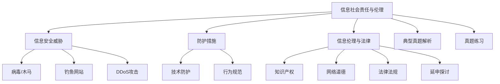

# 专题：信息社会责任与伦理（选修）

## 课程目标
1. 了解信息社会责任的重要性
2. 掌握信息安全威胁与防护措施
3. 了解信息伦理与法律

## 思维导图

## 目录
1. [信息安全威胁](#信息安全威胁)
2. [防护措施](#防护措施)
3. [信息伦理与法律](#信息伦理与法律)
4. [典型真题解析](#典型真题解析)
5. [真题练习](#真题练习)
6. [答案页](#答案页)

## 一、信息安全威胁

| 威胁类型 | 描述 |
| -------- | ---- |
| 病毒/木马 | 恶意程序，破坏数据或窃取信息 |
| 钓鱼网站 | 伪装正规网站，骗取用户账号密码 |
| DDoS攻击 | 通过大量请求瘫痪目标服务器 |

## 二、防护措施

| 类型 | 措施 |
| ---- | ---- |
| 技术防护 | 安装杀毒软件、启用防火墙、定期更新系统补丁 |
| 行为规范 | 不点击陌生链接、不随意下载文件、定期修改密码 |

## 三、信息伦理与法律

### 知识产权
- 禁止盗版软件
- 尊重原创内容（如引用需注明来源）

### 网络道德
- 不传播谣言
- 不参与网络暴力
- 保护他人隐私

### 法律法规

| 法律名称 | 描述 |
| -------- | ---- |
| 《网络安全法》 | 规范网络运营者行为，保护用户数据 |
| 《数据安全法》 | 规范数据处理活动，保障数据安全 |
| 《个人信息保护法》 | 明确个人信息处理规则，保障用户权益 |

### 延申探讨
- **AI伦理治理**：以人为本，构建人机协同生态
- **训练数据偏见**：算法歧视
- **无人驾驶、AI医疗等AI应用的责任边界**
- **行业冲击、教育分化等社会影响**

## 四、典型真题解析（10道）

1. **（2023山东真题） 以下符合信息道德的行为是（ ）。**
    
    A. 在论坛辱骂他人  
    B. 转载未核实的社会新闻  
    C. 引用他人文章时注明出处  
    D. 盗用他人照片并篡改  
    答案与解析：C。引用他人作品需注明来源，尊重知识产权。

2. **（2022山东真题） 防止个人信息泄露的最有效措施是（ ）。**
    
    A. 使用生日作为密码  
    B. 在公共电脑保存账号密码  
    C. 设置复杂密码并定期更换  
    D. 所有网站使用相同密码  
    答案：C

3. **（2021山东真题） 以下行为违反信息伦理的是（ ）。**
    
    A. 在社交平台发布真实信息  
    B. 未经授权转载他人文章  
    C. 使用正版软件  
    D. 加密个人文件  
    答案：B

4. **（2023山东真题） 《网络安全法》规定，网络运营者应（ ）。**
    
    A. 收集用户隐私并出售  
    B. 保障用户信息安全  
    C. 默认开放所有端口  
    D. 忽略数据备份  
    答案：B

5. **（2022山东真题） 以下属于网络暴力行为的是（ ）。**  
    A. 在论坛理性讨论  
    B. 发布虚假信息攻击他人  
    C. 引用他人文章并注明来源  
    D. 使用正版软件  
    答案：B

6. **（2021山东真题） 以下行为符合信息社会责任的是（ ）。**  
    A. 传播未经核实的谣言  
    B. 在社交平台发布真实信息  
    C. 盗版软件共享  
    D. 恶意攻击他人  
    答案：B

7. **（2023山东真题） 以下属于个人信息的是（ ）。**  
    A. 公共天气预报  
    B. 身份证号码  
    C. 政府公告  
    D. 历史事件记录  
    答案：B

8. **（2022山东真题） 以下行为违反《网络安全法》的是（ ）。**  
    A. 定期备份数据  
    B. 未经授权收集用户信息  
    C. 使用正版软件  
    D. 加密个人文件  
    答案：B

9.  **（2021山东真题） 以下属于网络道德规范的是（ ）。**  
    A. 随意公开他人隐私  
    B. 在社交平台散布谣言  
    C. 理性讨论，尊重他人  
    D. 使用黑客工具攻击网站  
    答案：C

10. **（2023山东真题） 以下属于知识产权保护范围的是（ ）。**  
    A. 盗版电影  
    B. 原创文章  
    C. 公共数据  
    D. 政府文件  
    答案：B

## 五、真题练习（30题）

1. 以下属于合法使用他人作品的是（ ）。  
    A. 未授权转载他人文章  
    B. 在论文中引用并注明来源  
    C. 盗版电影分享  
    D. 商业用途未付费

2. 网络道德要求我们（ ）。  
    A. 随意公开他人隐私  
    B. 在社交平台散布谣言  
    C. 理性讨论，尊重他人  
    D. 使用黑客工具攻击网站

3. 《网络安全法》规定，网络运营者应（ ）。  
    A. 收集用户隐私并出售  
    B. 保障用户信息安全  
    C. 默认开放所有端口  
    D. 忽略数据备份

4. 以下行为存在法律风险的是（ ）。  
    A. 购买正版软件  
    B. 下载盗版电影  
    C. 加密个人文件  
    D. 定期更新系统

5. 发现网络谣言后，正确做法是（ ）。  
    A. 立即转发  
    B. 向平台举报  
    C. 修改后传播  
    D. 保存但不处理

6. 以下属于个人信息的是（ ）。  
    A. 公共天气预报  
    B. 身份证号码  
    C. 政府公告  
    D. 历史事件记录

7. 以下行为符合信息社会责任的是（ ）。  
    A. 传播未经核实的谣言  
    B. 在社交平台发布真实信息  
    C. 盗版软件共享  
    D. 恶意攻击他人

8. 以下属于网络暴力行为的是（ ）。  
    A. 在论坛理性讨论  
    B. 发布虚假信息攻击他人  
    C. 引用他人文章并注明来源  
    D. 使用正版软件

9. 以下行为违反信息伦理的是（ ）。  
    A. 在社交平台发布真实信息  
    B. 未经授权转载他人文章  
    C. 使用正版软件  
    D. 加密个人文件

10. 以下属于知识产权保护范围的是（ ）。  
    A. 盗版电影  
    B. 原创文章  
    C. 公共数据  
    D. 政府文件

11. 以下行为符合网络道德的是（ ）。  
    A. 随意公开他人隐私  
    B. 在社交平台散布谣言  
    C. 理性讨论，尊重他人  
    D. 使用黑客工具攻击网站

12. 以下属于《网络安全法》规定的是（ ）。  
    A. 网络运营者需保障用户信息安全  
    B. 用户可随意公开他人隐私  
    C. 网络运营者可默认开放所有端口  
    D. 用户无需保护个人信息

13. 以下行为违反《个人信息保护法》的是（ ）。  
    A. 未经授权收集用户信息  
    B. 加密个人文件  
    C. 定期备份数据  
    D. 使用正版软件

14. 以下属于网络道德规范的是（ ）。  
    A. 随意公开他人隐私  
    B. 在社交平台散布谣言  
    C. 理性讨论，尊重他人  
    D. 使用黑客工具攻击网站

15. 以下属于信息安全防护措施的是（ ）。  
    A. 安装杀毒软件  
    B. 随意点击陌生链接  
    C. 使用简单密码  
    D. 忽略系统更新

16. 以下行为符合信息社会责任的是（ ）。  
    A. 传播未经核实的谣言  
    B. 在社交平台发布真实信息  
    C. 盗版软件共享  
    D. 恶意攻击他人

17. 以下属于网络暴力行为的是（ ）。  
    A. 在论坛理性讨论  
    B. 发布虚假信息攻击他人  
    C. 引用他人文章并注明来源  
    D. 使用正版软件

18. 以下行为违反信息伦理的是（ ）。  
    A. 在社交平台发布真实信息  
    B. 未经授权转载他人文章  
    C. 使用正版软件  
    D. 加密个人文件

19. 以下属于知识产权保护范围的是（ ）。  
    A. 盗版电影  
    B. 原创文章  
    C. 公共数据  
    D. 政府文件
 
20. 以下行为符合网络道德的是（ ）。  
    A. 随意公开他人隐私  
    B. 在社交平台散布谣言  
    C. 理性讨论，尊重他人  
    D. 使用黑客工具攻击网站

21. 以下属于《网络安全法》规定的是（ ）。  
    A. 网络运营者需保障用户信息安全  
    B. 用户可随意公开他人隐私  
    C. 网络运营者可默认开放所有端口  
    D. 用户无需保护个人信息

22. 以下行为违反《个人信息保护法》的是（ ）。  
    A. 未经授权收集用户信息  
    B. 加密个人文件  
    C. 定期备份数据  
    D. 使用正版软件

23. 以下属于网络道德规范的是（ ）。  
    A. 随意公开他人隐私  
    B. 在社交平台散布谣言  
    C. 理性讨论，尊重他人  
    D. 使用黑客工具攻击网站

24. 以下属于信息安全防护措施的是（ ）。  
    A. 安装杀毒软件  
    B. 随意点击陌生链接  
    C. 使用简单密码  
    D. 忽略系统更新

25. 以下行为符合信息社会责任的是（ ）。  
    A. 传播未经核实的谣言  
    B. 在社交平台发布真实信息  
    C. 盗版软件共享  
    D. 恶意攻击他人

26. 以下属于网络暴力行为的是（ ）。  
    A. 在论坛理性讨论  
    B. 发布虚假信息攻击他人  
    C. 引用他人文章并注明来源  
    D. 使用正版软件

27. 以下行为违反信息伦理的是（ ）。  
    A. 在社交平台发布真实信息  
    B. 未经授权转载他人文章  
    C. 使用正版软件  
    D. 加密个人文件

28. 以下属于知识产权保护范围的是（ ）。  
    A. 盗版电影  
    B. 原创文章  
    C. 公共数据  
    D. 政府文件

29. 以下行为符合网络道德的是（ ）。  
    A. 随意公开他人隐私  
    B. 在社交平台散布谣言  
    C. 理性讨论，尊重他人  
    D. 使用黑客工具攻击网站

30. 以下属于《网络安全法》规定的是（ ）。  
    A. 网络运营者需保障用户信息安全  
    B. 用户可随意公开他人隐私  
    C. 网络运营者可默认开放所有端口  
    D. 用户无需保护个人信息

## 六、答案页

| 题号 | 答案 |
| ---- | ---- |
| 1    | B    |
| 2    | C    |
| 3    | B    |
| 4    | B    |
| 5    | B    |
| 6    | B    |
| 7    | B    |
| 8    | B    |
| 9    | B    |
| 10   | B    |
| 11   | C    |
| 12   | A    |
| 13   | A    |
| 14   | C    |
| 15   | A    |
| 16   | B    |
| 17   | B    |
| 18   | B    |
| 19   | B    |
| 20   | C    |
| 21   | A    |
| 22   | A    |
| 23   | C    |
| 24   | A    |
| 25   | B    |
| 26   | B    |
| 27   | B    |
| 28   | B    |
| 29   | C    |
| 30   | A    |

