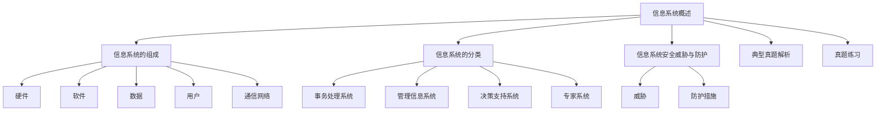

# 专题：信息系统概述（选修）

## 课程目标

1. 了解信息系统的基本概念和组成。
2. 掌握信息系统的分类方法。
3. 了解信息系统安全的威胁和防护措施。
4. 掌握典型真题的解析和练习。

## 思维导图   

## 目录
1. [信息系统的组成](#信息系统的组成)
2. [信息系统的分类](#信息系统的分类)
3. [信息系统安全威胁与防护](#信息系统安全威胁与防护)
4. [典型真题解析](#典型真题解析)
5. [真题练习](#真题练习)
6. [答案页](#答案页)

## 一、信息系统的组成

### 硬件（冯诺伊曼体系结构）

| 组成部分 | 描述 |
| -------- | ---- |
| 运算器   | 用于完成各种算术运算、逻辑运算和数据传送等数据加工处理 |
| 控制器   | 控制程序执行。运算器和控制器组合成计算机的中央处理器（CPU） |
| 存储设备 | 存储程序和数据。包括内部存储设备和外部存储设备。 |
| 输入设备 | 用于将数据或程序输入到计算机中。如键盘、鼠标、麦克风、触控设备 |
| 输出设备 | 将数据或程序的处理结果展示给用户。如显示器、音箱、电子屏幕等 |

### 软件

| 类型         | 描述 |
| ------------ | ---- |
| 系统软件     | 包括操作系统（如Windows、Android、IOS等）、数据库软件 |
| 应用软件     | 构建在系统软件之上，完成具体功能的程序。（如微信、QQ） |

### 数据
系统处理的核心对象（如用户信息、交易记录）。

### 用户
系统使用者（普通用户、管理员）。

### 通信网络
数据传输的媒介（如光纤、Wi-Fi）。

## 二、信息系统的分类

| 类型               | 描述 |
| ------------------ | ---- |
| 事务处理系统（TPS） | 处理日常事务（如超市收银系统、一卡通系统） |
| 管理信息系统（MIS） | 辅助管理决策（如库存管理系统） |
| 决策支持系统（DSS） | 提供数据分析支持（如销售预测系统） |
| 专家系统（ES）      | 模拟专家决策（如医疗诊断系统） |

## 三、信息系统安全威胁与防护

### 威胁

| 威胁类型 |
| -------- |
| 病毒     |
| 木马     |
| DDoS攻击 |
| 数据泄露 |

### 防护措施

| 防护措施 |
| -------- |
| 防火墙   |
| 数据加密 |
| 权限管理 |
| 定期备份 |

## 四、典型真题解析（10道）

1. **（2023山东真题） 超市收银系统属于（ ）。**
    A. 决策支持系统  
    B. 事务处理系统  
    C. 专家系统  
    D. 人工智能系统  
    答案与解析：B。事务处理系统用于处理日常交易。

2. **（2022山东真题） 防止数据被篡改的最佳措施是（ ）。**
    A. 定期备份  
    B. 安装杀毒软件  
    C. 数据加密  
    D. 限制用户权限  
    解析：数据加密可确保数据在传输和存储时不被篡改，答案C。

3. **（2021山东真题） 以下属于信息系统硬件的是（ ）。**
    A. 微信APP  
    B. Windows操作系统  
    C. 服务器  
    D. 用户手册  
    答案：C

4. **（2023山东真题） 专家系统的核心功能是（ ）。**
    A. 处理日常交易  
    B. 模拟人类专家决策  
    C. 存储海量数据  
    D. 提供网络通信  
    答案：B

5. **（2022山东真题） DDoS攻击的目的是（ ）。**
    A. 窃取用户密码  
    B. 瘫痪目标服务器  
    C. 传播病毒  
    D. 篡改数据  
    解析：DDoS通过大量请求耗尽服务器资源，答案B。

6. **（2021山东真题） 管理信息系统（MIS）主要用于（ ）。**
    A. 自动化生产流程  
    B. 辅助管理层决策  
    C. 娱乐游戏开发  
    D. 个人文件存储  
    答案：B

7. **（2023山东真题） 以下属于信息系统用户角色的是（ ）。**
    A. 服务器  
    B. 数据库  
    C. 管理员  
    D. 光纤网络  
    答案：C

8. **（2022山东真题） 防火墙的主要作用是（ ）。**
    A. 提高网速  
    B. 防止外部非法访问  
    C. 加密数据  
    D. 备份文件  
    答案：B

9. **（2021山东真题） 以下属于通信网络组件的是（ ）。**
    A. 路由器  
    B. Excel表格  
    C. 用户密码  
    D. 杀毒软件  
    答案：A

10. **（2023山东真题） 信息系统安全的“完整性”指（ ）。**
    A. 数据不被泄露  
    B. 数据不被篡改  
    C. 系统持续可用  
    D. 用户身份真实  
    答案：B

## 五、真题练习（30题）

1. 信息系统的核心组成部分是（ ）。
    A. 硬件  
    B. 数据  
    C. 用户  
    D. 软件

2. 以下属于事务处理系统的是（ ）。
    A. 医院挂号系统  
    B. 天气预报系统  
    C. 人脸识别系统  
    D. 股票分析软件

3. 防止数据泄露的有效措施是（ ）。
    A. 定期清理硬盘  
    B. 数据加密  
    C. 安装屏幕保护程序  
    D. 使用无线鼠标

4. 专家系统依赖的核心技术是（ ）。
    A. 数据库管理  
    B. 人工智能  
    C. 图形处理  
    D. 网络通信

5. 以下属于信息系统软件的是（ ）。
    A. 路由器  
    B. Android系统  
    C. 光纤  
    D. 身份证读卡器

6. DDoS攻击针对的是信息系统的（ ）。
    A. 硬件  
    B. 数据  
    C. 通信网络  
    D. 用户权限

7. 管理信息系统（MIS）的输出通常是（ ）。
    A. 原始数据  
    B. 分析报告  
    C. 物理设备  
    D. 加密文件

8. 信息系统中“权限管理”的目的是（ ）。
    A. 提高处理速度  
    B. 限制非法访问  
    C. 美化界面  
    D. 减少存储空间

9. 以下属于信息系统通信网络组件的是（ ）。
    A. 交换机  
    B. 键盘  
    C. 打印机  
    D. U盘

10. 数据备份的主要意义是（ ）。
    A. 提高系统性能  
    B. 防止数据丢失  
    C. 美化数据格式  
    D. 减少网络延迟

11. 信息系统的用户角色不包括（ ）。
    A. 普通用户  
    B. 系统管理员  
    C. 数据库  
    D. 访客

12. 以下属于信息系统安全威胁的是（ ）。
    A. 数据加密  
    B. 防火墙  
    C. 木马程序  
    D. 权限管理

13. 医院CT影像分析系统属于（ ）。
    A. 事务处理系统  
    B. 决策支持系统  
    C. 专家系统  
    D. 管理信息系统

14. 信息系统中“数据”可以是（ ）。
    A. 数字、文字、图像  
    B. 仅数字  
    C. 仅文字  
    D. 仅图像

15. 以下不属于信息系统硬件的是（ ）。
    A. 服务器  
    B. 智能手机  
    C. MySQL数据库  
    D. 温度传感器

16. 信息系统的“可用性”强调（ ）。
    A. 数据真实  
    B. 系统持续服务  
    C. 用户隐私  
    D. 界面美观

17. 防止病毒入侵的有效措施是（ ）。
    A. 定期更换密码  
    B. 安装杀毒软件  
    C. 使用复杂图表  
    D. 关闭显示器

18. 在线购物平台的核心系统是（ ）。
    A. 决策支持系统  
    B. 事务处理系统  
    C. 专家系统  
    D. 人工智能系统

19. 信息系统中“用户手册”属于（ ）。
    A. 硬件  
    B. 软件  
    C. 数据  
    D. 文档

20. 以下属于信息系统数据的是（ ）。
    A. 用户登录密码  
    B. 电脑机箱  
    C. 网线  
    D. 鼠标

21. 信息系统的开发步骤中，首先应进行（ ）。
    A. 系统设计  
    B. 需求分析  
    C. 系统测试  
    D. 硬件采购

22. 信息系统中“传感器”属于（ ）。
    A. 输入设备  
    B. 输出设备  
    C. 存储设备  
    D. 处理设备

23. 以下属于信息系统防护措施的是（ ）。
    A. 开放所有端口  
    B. 默认共享文件夹  
    C. 定期更新补丁  
    D. 使用简单密码

24. 信息系统的“决策支持系统”主要用于（ ）。
    A. 自动化流水线  
    B. 辅助制定战略  
    C. 存储客户信息  
    D. 播放音乐

25. 信息系统中“数据库”的作用是（ ）。
    A. 管理硬件资源  
    B. 存储和检索数据  
    C. 提供网络连接  
    D. 美化用户界面

26. 以下属于信息系统网络组件的是（ ）。
    A. 防火墙  
    B. CPU  
    C. 键盘  
    D. 电源线

27. 信息系统安全的“机密性”指（ ）。
    A. 数据不被篡改  
    B. 数据不被泄露  
    C. 系统持续运行  
    D. 用户身份真实

28. 学校选课系统属于（ ）。
    A. 专家系统  
    B. 事务处理系统  
    C. 决策支持系统  
    D. 人工智能系统

29. 以下属于信息系统输入设备的是（ ）。
    A. 打印机  
    B. 显示器  
    C. 扫描仪  
    D. 音箱

30. 信息系统中“权限管理”通常通过（ ）实现。
    A. 设置用户账号和密码  
    B. 更换硬件设备  
    C. 提高网速  
    D. 美化界面

## 六、答案页

| 题号 | 答案 |
| ---- | ---- |
| 1    | B    |
| 2    | A    |
| 3    | B    |
| 4    | B    |
| 5    | B    |
| 6    | C    |
| 7    | B    |
| 8    | B    |
| 9    | A    |
| 10   | B    |
| 11   | C    |
| 12   | C    |
| 13   | C    |
| 14   | A    |
| 15   | C    |
| 16   | B    |
| 17   | B    |
| 18   | B    |
| 19   | D    |
| 20   | A    |
| 21   | B    |
| 22   | A    |
| 23   | C    |
| 24   | B    |
| 25   | B    |
| 26   | A    |
| 27   | B    |
| 28   | B    |
| 29   | C    |
| 30   | A    |

