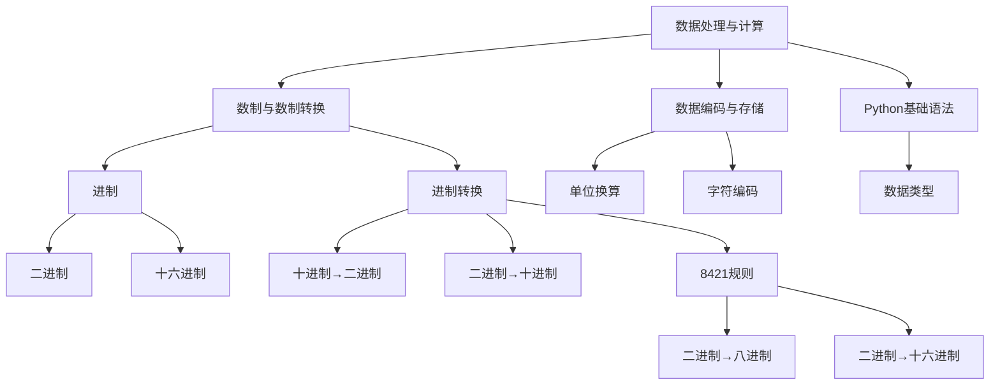

# 专题：数据处理与计算（必修一）

<a name="数据编码与进制转换"></a>


## 一、数制与数制转换

### 数制
基本要素：基数、数码和位权

|数制|基数|数码符号|用途|
|---|---|---|---|
|二进制|2|0和1|计算机内部使用|
|八进制|8|0-7|偶尔用于计算机领域|
|十六进制|16|0-9，A-F|经常用于计算机领域|
|十进制|10|0-9|日常使用|
>十六进制,基数为16，符号为0-9和A-F（A=10, B=11, ..., F=15）。

### 数制转换
- **二进制→十进制**：基数为2，符号为0和1  
  - 示例：`1010` = 1×2³ + 0×2² + 1×2¹ + 0×2⁰ = 10（十进制）
- **十进制→二进制**：除2取余法（反向取余数）  
  - 示例：13 → 1101（计算过程：13÷2=6余1 → 6÷2=3余0 → 3÷2=1余1 → 1÷2=0余1）
- **十六进制→十进制**：基数为16，符号为0-9和A-F（A=10, B=11, ..., F=15）  
  - 示例：`1A` = 1×16¹ + 10×16⁰ = 26（十进制）


### 8421规则
用于二进制与八进制、十六进制之间快速转换。

> #### 二进制→八进制
> 从低位到高位顺序，每3位一组，高位不满3位补0对齐，分别单独转换。

> #### 二进制→十六进制
> 从低位到高位顺序，每4位一组，高位不满4位补0对齐，分别单独转换

> #### 示例：二进制转换为十六进制
> （110110）2=（）16 
> 
|步骤|结果|
|---|---|
|分组对齐|[0011]  [0110]|
|标注位权|[8421]  [8421]|
|分组转换|[0×8+0×4+1×2+1×1=3]  [0×8+1×4+1×2+0×1=6]|
|合并结果|（36）16|


```python
# 示例：（110110）2=（）16
binary = "110110"
# 分组对齐
aligned = "00110110"
# 标注位权并分组转换
hex_result = "36"
```

<a name="数据存储单位"></a>

## 二、数据存储单位

| 单位   | 描述             |
| ------ | ---------------- |
| 位（bit）比特 | 最小单位，表示0或1 |
| 字节（Byte） | 1 Byte=8 bit   |

<a name="单位换算"></a>
## 三、单位换算
| 单位   | 换算关系             | 示例                 |
| ------ | -------------------- | -------------------- |
| 位（bit）比特 | 最小单位，表示0或1   | 1字节=8位            |
| 字节（B） | 1B = 8bit            | 字符"A"占1字节       |
| 千字节（KB）| 1KB = 1024B          | 小型文本文件约1KB    |
| 兆字节（MB）| 1MB = 1024KB         | 一首MP3约3~5MB       |
| 千兆字节（GB）| 1GB = 1024MB       | 高清电影约1GB        |

1B=8b，1KB = 1024B，1MB = 1024KB，1GB = 1024MB，1TB=1024GB

<a name="字符编码"></a>

## 四、字符编码


|编码类型|	描述|
|---|---|
| 输入码   | 汉字输入编码，如各类输入法编码           |
| 机内码   | 计算机内部存储汉字用编码，如GB2312、Unicode |
| 输出码   | 显示汉字用编码，字型码（点阵）           |

| 机内码 | 描述                                     |
| -------- | ---------------------------------------- |
| ASCII码  | 用1字节表示英文字符（0—127）`A`→65（十进制），`a`→97（十进制）             |
| GB2312、GBK|每个汉字占2字节 |
|Unicode（UTF-8）| 每个汉字占3~4字节|

<a name="Python基础语法"></a>

## 五、Python基础语法

### 变量赋值
```python
a = 5
```

### 输入输出
```python
# input()：接收字符串输入（需转换类型，如int(input())）
# print()：输出结果（如print("结果是：", x)）
```

<a name="数据类型"></a>

## 六、数据类型

| 类型     | 示例       |
| -------- | ---------- |
| 整数（int） | a = 10    |
| 浮点数（float） | b = 3.14 |
| 字符串（str） | s = "Hello" |

<a name="典型真题解析"></a>

## 七、典型真题解析（10道）

1. **（2023山东真题） 二进制数1010转换为十进制是（ ）。**
   - A. 8  
   - B. 10 
   - C. 12 
   - D. 14
   - 解析：1×2³+0×2²+1×2¹+0×2⁰=8+0+2+0=10，答案B。

2. **（2021山东真题） 以下Python代码输出结果是（ ）。**
   ```python
   x = 3  
   y = x * 2 + 1  
   print(y)  
   ```
   - A. 3	 
   - B. 6 
   - C. 7 
   - D. 9
   - 解析：3*2+1=7，答案C。

3. **（2022山东真题） 十进制数25转换为二进制是（ ）。**
   - A. 11001	
   - B. 10011	
   - C. 11101	
   - D. 10101
   - 解析：25÷2=12余1 → 12÷2=6余0 → 6÷2=3余0 → 3÷2=1余1 → 1÷2=0余1，逆序为11001，答案A。

4. **（2023山东真题） 存储一个汉字需要（ ）。**
   - A. 1字节	
   - B. 2字节	
   - C. 4字节	
   - D. 8字节
   - 解析：GB2312/GBK编码中，1个汉字占2字节，答案B。

5. **（2022山东真题） 以下属于无损压缩的是（ ）。**
   - A. JPEG图片	
   - B. MP3音频	
   - C. ZIP文件	
   - D. MP4视频
   - 解析：ZIP文件压缩后能完全恢复原始数据，答案C。

6. **（2021山东真题） 十六进制数“F”对应的十进制是（ ）。**
   - A. 15	
   - B. 16	
   - C. 17	
   - D. 18
   - 解析：十六进制F=15，答案A。

7. **（2023山东真题） Python中，print(2 ** 3)的输出是（ ）。**
   - A. 6	
   - B. 8	
   - C. 9	
   - D. 5
   - 解析：**表示幂运算，2³=8，答案B。

8. **（2022山东真题） 以下代码的功能是（ ）。**
   ```python
   a = int(input())  
   print(a % 10)  
   ```
   - A. 输出a的个位数字	
   - B. 输出a的十位数字	
   - C. 输出a除以10的商		
   - D. 输出a的平方
   - 解析：a % 10取a的个位数字，答案A。

9. **（2021山东真题） 以下单位换算正确的是（ ）。**
   - A. 1MB = 1000KB	
   - B. 1GB = 1024MB	
   - C. 1KB = 1000B	
   - D. 1B = 10bit
   - 解析：1GB=1024MB，答案B。

10. **（2023山东真题） 以下Python表达式结果为浮点数的是（ ）。**
    - A. 5 + 3		
    - B. 10 / 2		
    - C. 4 * 2		
    - D. 7 % 3
    - 解析：/运算结果为浮点数（如10/2=5.0），答案B。

<a name="真题练习"></a>

## 八、真题练习（30题）

1. 二进制数1101对应的十进制是（ ）。
   - A. 11	
   - B. 13	
   - C. 15	
   - D. 17

2. ASCII码占用的存储空间是（ ）。
   - A. 1位	 
   - B. 1字节	
   - C. 2字节	
   - D. 4字节

3. 1MB等于多少KB？（ ）。
   - A. 1000	
   - B. 1024	
   - C. 10000	
   - D. 2048

4. 十进制数25转换为二进制是（ ）。
   - A. 11001	
   - B. 10011	
   - C. 11101	
   - D. 10101

5. 以下Python代码输出结果是（ ）。
    ```python
    a = 5  
    b = a // 2  
    print(b)  
    ```
   - A. 2	 
   - B. 2.5	 
   - C. 3	
   - D. 5

6. 存储一个汉字需要（ ）。
   - A. 1字节	
   - B. 2字节	
   - C. 4字节	
   - D. 8字节

7. 计算机内部处理数据采用（ ）。
   - A. 十进制	 
   - B. 二进制	
   - C. 八进制	
   - D. 十六进制

8. 以下属于无损压缩的是（ ）。
   - A. JPEG图片	
   - B. MP3音频	
   - C. ZIP文件	
   - D. MP4视频

9. Python中，print(3 + 5 * 2)的输出是（ ）。
   - A. 16	 
   - B. 13	
   - C. 10	
   - D. 8

10. 十六进制数“A”对应的十进制是（ ）。
    - A. 9	
    - B. 10	
    - C. 11	
    - D. 12

11. 以下Python代码的输出是（ ）。
    ```python
    print(2 ** 3 + 5)  
    ```
    - A. 8	 
    - B. 13	
    - C. 10	
    - D. 7

12. 二进制数1001与1010相加的结果是（ ）。
    - A. 10011	
    - B. 10101	
    - C. 11011	
    - D. 11111

13. 1GB等于多少MB？（ ）。
    - A. 1000	
    - B. 1024	
    - C. 10000	
    - D. 2048

14. Python中，input()函数接收的数据类型是（ ）。
    - A. 整数	
    - B. 浮点数	 
    - C. 字符串	
    - D. 布尔值

15. 以下属于有损压缩的是（ ）。
    - A. TXT文本	
    - B. ZIP文件	
    - C. MP3音频	
    - D. PNG图片

16. 十进制数15转换为十六进制是（ ）。
    - A. A	
    - B. B	
    - C. F	
    - D. E

17. Python中，print("3" + "5")的输出是（ ）。
    - A. 8	
    - B. 35	
    - C. "35"	
    - D. 报错

18. 以下单位从大到小排列正确的是（ ）。
    - A. GB > MB > KB > B	 
    - B. MB > GB > KB > B
    - C. B > KB > MB > GB	 
    - D. GB > KB > MB > B

19. 二进制数1110对应的十进制是（ ）。
    - A. 12	 
    - B. 13	
    - C. 14	
    - D. 15

20. 存储100个ASCII字符需要（ ）。
    - A. 100位	 
    - B. 100字节	
    - C. 200字节	
    - D. 800字节

21. Python中，表达式10 / 3的结果是（ ）。
    - A. 3	
    - B. 3.333...	
    - C. 3.0	
    - D. 1

22. 十六进制数“1A”对应的十进制是（ ）。
    - A. 10	
    - B. 16	
    - C. 26	
    - D. 32

23. 以下代码的输出是（ ）。
    ```python
    a = 10  
    b = 3  print(a % b)  
    ```
    - A. 1	 
    - B. 3	
    - C. 0	
    - D. 10

24. 1TB等于多少GB？（ ）。
    - A. 1000	
    - B. 1024	
    - C. 10000	 
    - D. 2048

25. 以下Python代码的功能是（ ）。
    ```python
    num = int(input())  
    print(num ** 2)  
    ```
    - A. 输出num的平方根	
    - B. 输出num的平方	
    - C. 输出num的立方		
    - D. 输出num除以2的余数

26. 二进制数1011与1101按位与运算的结果是（ ）。
    - A. 1001	
    - B. 1011	
    - C. 1101	
    - D. 1111

27. 以下属于文本文件格式的是（ ）。
    - A. .txt	
    - B. .jpg	
    - C. .mp4	
    - D. .exe

28. Python中，print(int(5.9))的输出是（ ）。
    - A. 5	
    - B. 6	
    - C. 5.9	
    - D. 报错

29. 十进制数255转换为二进制是（ ）。
    - A. 11111111	
    - B. 11111110	
    - C. 10000000	
    - D. 10101010

30. 以下Python代码的输出是（ ）。
    ```python
    x = "12"  
    y = int(x) + 3  
    print(y)  
    ```
    - A. 15	
    - B. 123	 
    - C. 报错	
    - D. "123"

<a name="答案页"></a>

## 九、答案页

1.B　2. B　3. B　4. A　5. A　6. B　7. B　8. C　9. B　10. B

11.B　12. A　13. B　14. C　15. C　16. C　17. B　18. A　19. C　20. B

21.B　22. C　23. A　24. B　25. B　26. A　27. A　28. A　29. A　30. A


