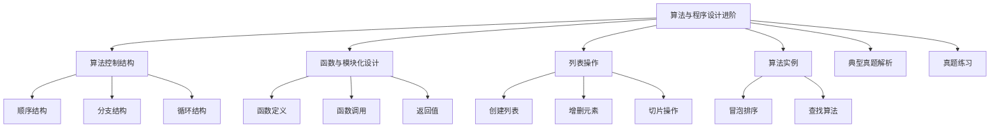

# 专题：算法与程序设计进阶（必修一）

## 思维导图



## 目录
1. [算法控制结构](#算法控制结构)
2. [函数与模块化设计](#函数与模块化设计)
3. [列表操作](#列表操作)
4. [算法实例](#算法实例)
5. [典型真题解析](#典型真题解析)
6. [真题练习](#真题练习)
7. [答案页](#答案页)

<a name="算法控制结构"></a>
## 一、算法控制结构

### 顺序结构
代码按顺序逐行执行。

### 分支结构
if-elif-else语句实现条件判断。

| 类型     | 格式                                      |
| -------- | ----------------------------------------- |
| 单分支   | if 条件：                                 |
|          |     语句或语句组                          |
| 双分支   | if 条件：                                 |
|          |     语句或语句组A                         |
|          | else:                                    |
|          |     语句或语句组B                         |
| 多分支   | if 条件：                                 |
|          |     语句或语句组A                         |
|          | elif:                                    |
|          |     语句或语句组B                         |
|          | elif：                                   |
|          |     ……                                   |
|          | else:                                    |
|          |     语句或语句组n                         |

```python
# 示例
age = int(input("请输入你的年龄"))
if age >= 18:
    print("你已经成年!")
else:
    print("你是未成年人！")
```

### 循环结构
Python中的循环分为两种，一定次数的循环（计数循环）和重复到某种情况结束的条件循环（条件循环）。分别用for和while语句来实现。

#### for循环
计数循环，需要知道循环次数。

| 格式                     | 代码                                      | 运行结果                     |
| ------------------------ | ----------------------------------------- | ---------------------------- |
| for 循环变量 in 列表：    | for i in ['1', '2', 'hello', 'world']:   | 1                            |
|                          |     print(i)                              | 2                            |
|                          |                                           | hello                        |
|                          |                                           | world                        |
| for i in range():        | for i in range(5):                        | 0                            |
|                          |     print(i)                              | 1                            |
|                          |                                           | 2                            |
|                          |                                           | 3                            |
|                          |                                           | 4                            |
|                          | for i in range(1, 6):                     | 1                            |
|                          |     print(i)                              | 2                            |
|                          |                                           | 3                            |
|                          |                                           | 4                            |
|                          |                                           | 5                            |

#### while循环
条件循环，满足条件时重复执行。

```python
# 示例
s = 0
while s <= 30:
    s = s + 10       # 循环体
    print(s)       # 循环体
```

运行结果：
```
10
20
30
40
```

#### 强制退出循环
- break：强制退出循环体，执行循环体后面的语句
- continue：跳过本次循环，执行循环体内下一轮循环

<a name="函数与模块化设计"></a>
## 二、函数与模块化设计

### 函数定义
```python
def 函数名(参数):
    函数体
    return 返回值
```

### 函数调用
```python
函数名(实际参数)
```

### 返回值
return语句返回结果。

```python
# 示例
def speed(s, t):
    v = s / t
    return v

# 调用函数speed(), 将计算结果赋给变量V
V = speed(1000, 40)  # V的值为25
```

<a name="列表操作"></a>
## 三、列表操作

### 创建列表
```python
list = [1, 2, "a"]
```

### 增删元素
- append()添加到列表尾部
- pop()删除

### 切片操作
```python
list[start:end]截取子列表。
```

切片是Python中截取序列数据（列表、字符串、元组等）的快捷方式，通过指定起始、结束位置和步长，生成一个新的子序列。

核心规则：
- start：起始索引（包含）
- end：结束索引（不包含）
- step：步长（正数从左到右，负数从右到左）

```python
# 示例
nums = [0, 1, 2, 3, 4, 5, 6, 7, 8, 9]
print(nums[2:5])      # 取索引2到5（不包含5）的元素，输出 [2, 3, 4]
print(nums[:3])       # 取前3个元素（start默认0），输出 [0, 1, 2]
print(nums[-3:])      # 取倒数第3个到末尾，输出 [7, 8, 9]
print(nums[::2])      # 每2个元素取一次，输出 [0, 2, 4, 6, 8]
print(nums[::-1])     # 反转列表，输出 [9, 8, 7, 6, 5, 4, 3, 2, 1, 0]
```

<a name="算法实例"></a>
## 四、算法实例

### 冒泡排序
相邻元素比较并交换。

### 查找算法
- 顺序查找
- 二分查找（需有序列表）

<a name="典型真题解析"></a>
## 五、典型真题解析（10道）

1. **（2023山东真题） 以下代码的输出是（ ）。**
    ```python
    for i in range(3):  
        print(i * 2, end=" ")  
    ```
    A. 0 2 4  
    B. 0 1 2  
    C. 2 4 6  
    D. 0 2 4 6
    解析：i取值0,1,2，依次输出0,2,4，答案A。

2. **（2022山东真题） 以下函数的功能是（ ）。**
    ```python
    def f(x):  
        return x % 2 == 0  
    ```
    A. 计算x的平方  
    B. 判断x是否为偶数  
    C. 返回x除以2的商  
    D. 将x转换为二进制
    答案：B

3. **（2021山东真题） 执行以下代码后，列表a的值是（ ）。**
    ```python
    a = [3, 1, 4]  
    a.append(2)  
    a.pop(1)  
    ```
    A. [3, 4, 2]  
    B. [3, 1, 4, 2]  
    C. [1, 4, 2]  
    D. [3, 4]
    解析：append(2)后列表为[3,1,4,2]，pop(1)删除索引1的元素1，结果为[3,4,2]，答案A。

4. **（2023山东真题） 以下代码的输出是（ ）。**
    ```python
    s = 0  
    for i in range(1, 6, 2):  
        s += i  
    print(s)  
    ```
    A. 6  
    B. 9  
    C. 15  
    D. 5
    解析：range(1,6,2)生成1,3,5，累加和为9，答案B。

5. **（2022山东真题） 以下代码的输出是（ ）。**
    ```python
    list = ["a", "b", "c"]  
    print(list[1:])  
    ```
    A. ["a"]  
    B. ["b", "c"]  
    C. ["a", "b"]  
    D. ["c"]
    答案：B

6. **（2021山东真题） 以下代码的功能是（ ）。**
    ```python
    def func(n):  
        if n == 0:  
            return 1  
        else:  
            return n * func(n-1)  
    ```
    A. 计算n的阶乘  
    B. 计算n的累加和  
    C. 判断n是否为素数  
    D. 生成斐波那契数列
    解析：递归计算阶乘，答案A。

7. **（2023山东真题） 以下代码的输出是（ ）。**
    ```python
    a = [5, 2, 7, 1]  
    a.sort()  
    print(a[0])  
    ```
    A. 5  
    B. 1  
    C. 2  
    D. 7
    解析：sort()升序排序后列表为[1,2,5,7]，答案B。

8. **（2022山东真题） 以下代码的输出是（ ）。**
    ```python
    x = 10  
    while x > 5:  
        x -= 2  
    print(x)  
    ```
    A. 5  
    B. 4  
    C. 6  
    D. 3
    解析：循环过程为10→8→6→4，退出循环时x=4，答案B。

9. **（2021山东真题） 以下代码的输出是（ ）。**
    ```python
    s = "hello"  
    print(s[1:4])  
    ```
    A. "hel"  
    B. "ell"  
    C. "llo"  
    D. "hlo"
    答案：B

10. **（2023山东真题） 以下代码的输出是（ ）。**
    ```python
    a = [1, 2, 3]  
    b = a.copy()  
    b.append(4)  
    print(len(a))  
    ```
    A. 3  
    B. 4  
    C. 1  
    D. 0
    解析：b是a的副本，修改b不影响a，答案A。

<a name="真题练习"></a>
## 六、真题练习（37题）

1. 以下代码的输出是（ ）。
    ```python
    print(3 + 5 * 2)  
    ```
    A. 16  
    B. 13  
    C. 10  
    D. 8

2. 函数abs(-5)的返回值是（ ）。
    A. -5  
    B. 5  
    C. 0  
    D. 25

3. 以下代码的输出是（ ）。
    ```python
    for i in range(2):  
        print(i, end=" ")  
    ```
    A. 0 1  
    B. 1 2  
    C. 0 1 2  
    D. 0

4. 执行a = [2, 4, 6]; a.insert(1, 3)后，列表a的值是（ ）。
    A. [2, 3, 4, 6]  
    B. [3, 2, 4, 6]  
    C. [2, 4, 3, 6]  
    D. [2, 3, 6]

5. 以下代码的输出是（ ）。
    ```python
    x = 5  
    if x > 3:  
        print("A")  
    else:  
        print("B")  
    ```
    A. A  
    B. B  
    C. AB  
    D. 无输出

6. 表达式"12" + "34"的结果是（ ）。
    A. 46  
    B. "1234"  
    C. "46"  
    D. 报错

7. 以下代码的功能是（ ）。
    ```python
    sum = 0  
    for i in range(1, 6):  
        sum += i  
    print(sum)  
    ```
    A. 计算1到5的累加和  
    B. 计算1到5的乘积  
    C. 输出1到5的每个数  
    D. 计算1到6的累加和

8. 以下代码的输出是（ ）。
    ```python
    list = ["apple", "banana", "cherry"]  
    print(list[-1])  
    ```
    A. "apple"  
    B. "banana"  
    C. "cherry"  
    D. 报错

9. 表达式3 ** 2的值是（ ）。
    A. 6  
    B. 9  
    C. 8  
    D. 5

10. 以下代码的输出是（ ）。
    ```python
    a = 10  
    b = a  
    b = 20  
    print(a)  
    ```
    A. 10  
    B. 20  
    C. 30  
    D. 报错

11. 以下代码的输出是（ ）。
    ```python
    s = "Python"  
    print(s[2])  
    ```
    A. P  
    B. y  
    C. t  
    D. h

12. 以下代码的输出是（ ）。
    ```python
    x = 7  
    print(x // 2)  
    ```
    A. 3  
    B. 3.5  
    C. 4  
    D. 1

13. 函数len("Hello")的返回值是（ ）。
    A. 5  
    B. 6  
    C. 4  
    D. 报错

14. 以下代码的输出是（ ）。
    ```python
    a = [1, 2, 3]  
    b = a  
    b.append(4)  
    print(a)  
    ```
    A. [1, 2, 3]  
    B. [1, 2, 3, 4]  
    C. [4]  
    D. 报错

15. 以下代码的输出是（ ）。
    ```python
    print(10 % 3)  
    ```
    A. 1  
    B. 3  
    C. 0  
    D. 10

16. 以下代码的输出是（ ）。
    ```python
    def add(a, b):  
        return a + b  
    print(add(3, 5))  
    ```
    A. 8  
    B. 35  
    C. 报错  
    D. 无输出

17. 以下代码的输出是（ ）。
    ```python
    list = [4, 1, 3, 2]  
    list.sort()  
    print(list)  
    ```
    A. [1, 2, 3, 4]  
    B. [4, 3, 2, 1]  
    C. [4, 1, 3, 2]  
    D. 报错

18. 表达式"a" in ["apple", "banana"]的值是（ ）。
    A. True  
    B. False  
    C. 报错  
    D. None

19. 以下代码的输出是（ ）。
    ```python
    x = 0  
    while x < 5:  
        x += 1  
    print(x)  
    ```
    A. 5  
    B. 4  
    C. 6  
    D. 0

20. 以下代码的输出是（ ）。
    ```python
    print(type(3.14))  
    ```
    A. <class 'int'>  
    B. <class 'float'>  
    C. <class 'str'>  
    D. <class 'list'>

21. 在Python中执行以下语句的结果是：（  ）
    ```python
    i = 1  
    a = 0  
    while i <= 5:  
        a = a + i  
        i = i + 1  
    print(a)  
    ```
    A. 14  
    B. 15  
    C. 18  
    D. 20

22. 在Python中执行如下语句，循环体执行的次数是（  ）
    ```python
    k = 100  
    while k > 1:  
        print(k)  
        k = k / 2  
    ```
    A. 5  
    B. 6  
    C. 7  
    D. 8

23. 以下代码的输出是（ ）。
    ```python
    def func(x):  
        return x ** 2  
    print(func(4))  
    ```
    A. 8  
    B. 16  
    C. 4  
    D. 2

24. 在Python中定义一个求最大值的函数，函数名写法正确的是（  ）
    A. def max_1(x,y)  
    B. def max_1(x:y)  
    C. def max_1(x,y):  
    D. fef max_1(x:y):

25. 表达式[i for i in range(3)]的结果是（ ）。
    A. [0, 1, 2]  
    B. [1, 2, 3]  
    C. [0, 1]  
    D. [3]

26. 以下代码的输出是（ ）。
    ```python
    print(3 > 5 or 5 > 3)  
    ```
    A. True  
    B. False  
    C. None  
    D. 报错

27. 以下代码的输出是（ ）。
    ```python
    a = {"name": "Tom", "age": 18}  
    print(a["age"])  
    ```
    A. "Tom"  
    B. 18  
    C. {"age": 18}  
    D. 报错

28. 以下代码的输出是（ ）。
    ```python
    print(2 + 3 * 4)  
    ```
    A. 20  
    B. 14  
    C. 24  
    D. 9

29. 在Python中运行下面的程序后的输出结果为（  ）
    ```python
    n = 1  
    for i in range(0, 5):  
        n = n * i  
    print(n)  
    ```
    A. 0  
    B. 24  
    C. 25  
    D. 120

30. 以下代码的输出是（ ）。
    ```python
    list = [1, 2, 3]  
    list.remove(2)  
    print(list)  
    ```
    A. [1, 3]  
    B. [1, 2]  
    C. [2, 3]  
    D. 报错

31. 在Python中执行如下程序，结果是（  ）
    ```python
    s = 0  
    while s <= 30:  
        s = s + 10  
    print(s)  
    ```
    A. 20  
    B. 30  
    C. 40  
    D. 60

32. 在Python中执行如下代码，结果是（ ）
    ```python
    s = 0  
    for i in range(1, 11):  
        s = s + i  
    print(s)  
    ```
    A. 10  
    B. 11  
    C. 55  
    D. 66

33. 在Python中运行下面的程序段后的结果为（    ）
    ```python
    s = 0  
    for i in range(1, 6, 2):  
        s = s + i  
    print(s)  
    ```
    A. 15  
    B. 12  
    C. 10  
    D. 9

34. 在Python中运行如下代码后s的值为（  ）
    ```python
    s = 0  
    i = 0  
    while i <= 7:  
        s = s + i  
        i = i + 2  
    print(s)  
    ```
    A. 2  
    B. 12  
    C. 20  
    D. 22

35. python中当知道条件为真，想要程序无限执行直到人为停止的话，需要下列哪个选项（  ）：
    A. for  
    B. break  
    C. while  
    D. if

36. python中跳过当前循环中剩余的语句，进入下一次循环的关键词是（  ）
    A. break  
    B. continue  
    C. go  
    D. return

37. 下列序列能采用二分查找法查找某一元素的是（  ）
    A. 6  9  12  14  23  25  
    B. 1  4  7  15  13  99  
    C. 15  14  12  7  2  3  
    D. 34  25  17  9  10  3

<a name="答案页"></a>
## 七、答案页

1. B  
2. B  
3. A  
4. A  
5. A  
6. B  
7. A  
8. C  
9. B  
10. A  
11. B  
12. A  
13. A  
14. B  
15. A  
16. A  
17. A  
18. B  
19. A  
20. B  
21. B  
22. B  
23. B  
24. C  
25. A  
26. A  
27. B  
28. B  
29. A  
30. A  
31. C  
32. C  
33. D  
34. C  
35. C  
36. B  
37. A


