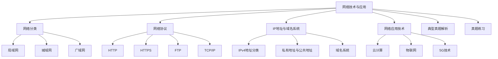

# 专题：网络技术与应用（选修）

## 课程目标
1. 了解网络技术的基本概念和分类。
2. 掌握网络协议的基本原理和应用。
3. 了解IP地址与域名系统的作用和原理。
   
## 知识点
1. 网络分类（局域网、城域网、广域网）
2. 网络协议（HTTP、HTTPS、FTP、TCP/IP）
3. IP地址与域名系统（IPv4地址分类、私有地址与公共地址、域名系统）
4. 网络应用技术（云计算、物联网、5G技术）
   

## 思维导图

## 目录
1. [网络分类](#网络分类)
2. [网络协议](#网络协议)
3. [IP地址与域名系统](#IP地址与域名系统)
4. [网络应用技术](#网络应用技术)
5. [典型真题解析](#典型真题解析)
6. [真题练习](#真题练习)
7. [答案页](#答案页)

## 一、网络分类

| 网络类型 | 覆盖范围 | 速度 | 常用设备 |
| -------- | -------- | ---- | ------- |
| 局域网（LAN） | 家庭、学校、办公室，不超过10公里 | 高速 | 交换机、路由器 |
| 城域网（MAN） | 覆盖一个城市或地市 | 较高 | 路由器、光缆 |
| 广域网（WAN） | 覆盖范围广，如互联网 | 一般 | 路由器、光缆 |

## 二、网络协议

| 协议名称 | 功能 | 默认端口 | 特点 |
| -------- | ---- | ------- | ---- |
| HTTP | 网页传输 | 80 | 面向无连接 |
| HTTPS | 加密网页传输 | 443 | 安全可靠 |
| FTP | 文件上传下载 | 21 | 面向连接 |
| TCP | 保证数据传输可靠性 | - | 面向连接 |
| IP | 数据包路由寻址 | - | 无连接 |

## 三、IP地址与域名系统（DNS）

### IPv4地址分类

| 类别 | 地址范围 | 用途 |
| ---- | ------- | ---- |
| A类 | 1.0.0.0 ——126.255.255.255 | 大型网络 |
| B类 | 128.0.0.0 —— 191.255.255.255 | 中型网络 |
| C类 | 192.0.0.0 —— 223.255.255.255 | 小型网络 |

### 私有地址与公共地址

| 地址类型 | 网段 | 使用范围 |
| -------- | ---- | ------- |
| 私有地址 | 10.0.0.0 - 10.255.255.255 172.16.0.0 - 172.31.255.255 192.168.0.0 - 192.168.255.255 | 局域网内部 |
| 公共地址 | - | 互联网通信 |

### 域名系统（DNS）

- 将域名（如www.baidu.com）解析为对应的IP地址。
- 分类：
  - **顶级域名**（如.com、.org、.net）
  - **二级域名**（如.baidu.com中的baidu）
  - **子域名**（如mail.baidu.com中的mail）

## 四、网络应用技术

| 技术名称 | 描述 |
| -------- | ---- |
| 云计算 | 按需使用计算资源，支持存储、数据库、AI服务 |
| 物联网（IoT） | 通过传感器连接物理设备 |
| 5G技术 | 高速度、低延迟 |

## 五、典型真题解析（10道）

1. **（2023山东真题） 以下属于C类IP地址的是（ ）。**
    A. 10.0.0.1  
    B. 172.16.0.1  
    C. 192.168.1.1  
    D. 224.0.0.1  
    答案与解析：C。C类地址范围为192.0.0.0~223.255.255.255。

2. **（2022山东真题） 将域名转换为IP地址的服务是（ ）。**
    A. HTTP  
    B. DNS  
    C. FTP  
    D. TCP  
    答案：B

3. **（2021山东真题） 物联网的核心技术是（ ）。**
    A. 虚拟现实  
    B. 传感器与网络通信  
    C. 区块链  
    D. 人工智能  
    答案：B

4. **（2023山东真题） HTTP协议的默认端口号是（ ）。**
    A. 21  
    B. 80  
    C. 443  
    D. 3306  
    答案：B

5. **（2022山东真题） 以下属于广域网（WAN）的是（ ）。**
    A. 家庭WiFi  
    B. 校园网  
    C. 中国电信互联网  
    D. 公司内部网络  
    答案：C

6. **（2021山东真题） TCP协议的主要功能是（ ）。**
    A. 数据加密  
    B. 确保可靠传输  
    C. 域名解析  
    D. 文件压缩  
    答案：B

7. **（2023山东真题） 以下属于网络传输介质的是（ ）。**
    A. 光纤  
    B. U盘  
    C. 打印机  
    D. 键盘  
    答案：A

8. **（2022山东真题） 云计算的优势不包括（ ）。**
    A. 按需付费  
    B. 本地存储数据  
    C. 弹性扩展资源  
    D. 远程访问  
    答案：B

9. **（2021山东真题） 以下属于物联网应用的是（ ）。**
    A. 智能手环监测心率  
    B. 使用Excel制作表格  
    C. 用Word写作文  
    D. 打印文件  
    答案：A

10. **（2023山东真题） IPv4地址中，B类地址的首段范围是（ ）。**
    A. 1——126  
    B. 128——191  
    C. 192——223  
    D. 224——239  
    答案：B

## 六、真题练习（30题）

1. 以下属于广域网（WAN）的是（ ）。
    A. 家庭WiFi  
    B. 校园网  
    C. 中国电信互联网  
    D. 公司内部网络

2. FTP协议的主要功能是（ ）。
    A. 网页浏览  
    B. 文件传输  
    C. 实时聊天  
    D. 视频播放

3. IPv4地址中，C类地址的首段范围是（ ）。
    A. 1——126  
    B. 128——191  
    C. 192——223  
    D. 224——239

4. DNS的作用是（ ）。
    A. 分配IP地址  
    B. 域名解析  
    C. 加密数据传输  
    D. 防止网络攻击

5. 以下属于物联网应用的是（ ）。
    A. 智能手环监测心率  
    B. 使用Excel制作表格  
    C. 用Word写作文  
    D. 打印文件

6. TCP/IP协议中的“IP”属于（ ）。
    A. 应用层  
    B. 传输层  
    C. 网络层  
    D. 数据链路层

7. 以下URL中，域名部分是（ ）。
    http://www.example.com:8080/path/page.html
    A. http  
    B. www.example.com  
    C. 8080  
    D. /path/page.html

8. 云计算的优势不包括（ ）。
    A. 按需付费  
    B. 本地存储数据  
    C. 弹性扩展资源  
    D. 远程访问

9. 以下属于网络传输介质的是（ ）。
    A. 光纤  
    B. U盘  
    C. 打印机  
    D. 键盘

10. HTTP协议的默认端口号是（ ）。
    A. 21  
    B. 80  
    C. 443  
    D. 3306

11. 以下属于局域网设备的是（ ）。
    A. 路由器  
    B. 卫星  
    C. 光缆  
    D. 5G基站

12. 以下协议中用于加密网页传输的是（ ）。
    A. HTTP  
    B. HTTPS  
    C. FTP  
    D. TCP

13. IPv4地址172.16.0.1属于（ ）。
    A. A类  
    B. B类  
    C. C类  
    D. D类

14. 物联网的英文缩写是（ ）。
    A. VR  
    B. IoT  
    C. AI  
    D. DNS

15. 以下属于云计算服务的是（ ）。
    A. 本地硬盘存储  
    B. 阿里云服务器租赁  
    C. U盘备份  
    D. 光盘刻录

16. TCP协议的特点是（ ）。
    A. 无连接、不可靠  
    B. 有连接、可靠  
    C. 仅用于文件传输  
    D. 支持广播通信

17. 以下属于网络层设备的是（ ）。
    A. 交换机  
    B. 路由器  
    C. 网卡  
    D. 集线器

18. 子网掩码255.255.255.0常用于（ ）。
    A. A类网络  
    B. B类网络  
    C. C类网络  
    D. D类网络

19. 以下属于无线网络技术的是（ ）。
    A. Wi-Fi  
    B. 光纤  
    C. 双绞线  
    D. 同轴电缆

20. 5G技术的主要优势是（ ）。
    A. 高延迟  
    B. 低速率  
    C. 大连接数  
    D. 仅支持语音

21. 以下属于网络应用层协议的是（ ）。
    A. IP  
    B. TCP  
    C. HTTP  
    D. ARP

22. 以下IPv4地址中，属于私有地址的是（ ）。
    A. 10.0.0.1  
    B. 200.100.50.1  
    C. 172.32.0.1  
    D. 224.0.0.1

23. 物联网中常见的传感器不包括（ ）。
    A. 温度传感器  
    B. 光敏传感器  
    C. 机械键盘  
    D. 运动传感器

24. 以下属于DNS服务器功能的是（ ）。
    A. 存储网页内容  
    B. 解析域名为IP  
    C. 加密数据传输  
    D. 过滤网络攻击

25. 以下属于网络拓扑结构的是（ ）。
    A. 星型  
    B. 树型  
    C. 环型  
    D. 以上都是

26. 以下属于网络安全威胁的是（ ）。
    A. DDoS攻击  
    B. 数据备份  
    C. 防火墙  
    D. 杀毒软件

27. 以下设备中，工作在数据链路层的是（ ）。
    A. 路由器  
    B. 交换机  
    C. 集线器  
    D. 中继器

28. 以下属于云计算部署模式的是（ ）。
    A. 公有云  
    B. 私有云  
    C. 混合云  
    D. 以上都是

29. IPv4地址的总长度是（ ）。
    A. 16位  
    B. 32位  
    C. 64位  
    D. 128位

30. 以下属于网络应用的是（ ）。
    A. 在线视频会议  
    B. 本地文档编辑  
    C. 单机游戏  
    D. 计算器程序

## 七、答案页

| 题号 | 答案 |
| ---- | ---- |
| 1    | C    |
| 2    | B    |
| 3    | C    |
| 4    | B    |
| 5    | A    |
| 6    | C    |
| 7    | B    |
| 8    | B    |
| 9    | A    |
| 10   | B    |
| 11   | A    |
| 12   | B    |
| 13   | B    |
| 14   | B    |
| 15   | B    |
| 16   | B    |
| 17   | B    |
| 18   | C    |
| 19   | A    |
| 20   | C    |
| 21   | C    |
| 22   | A    |
| 23   | C    |
| 24   | B    |
| 25   | D    |
| 26   | A    |
| 27   | B    |
| 28   | D    |
| 29   | B    |
| 30   | A    |

